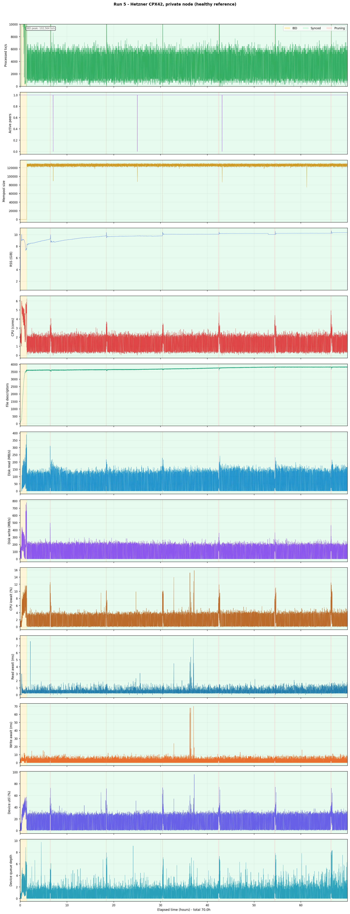
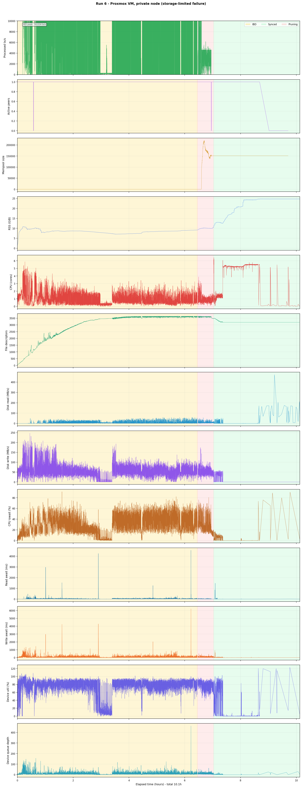
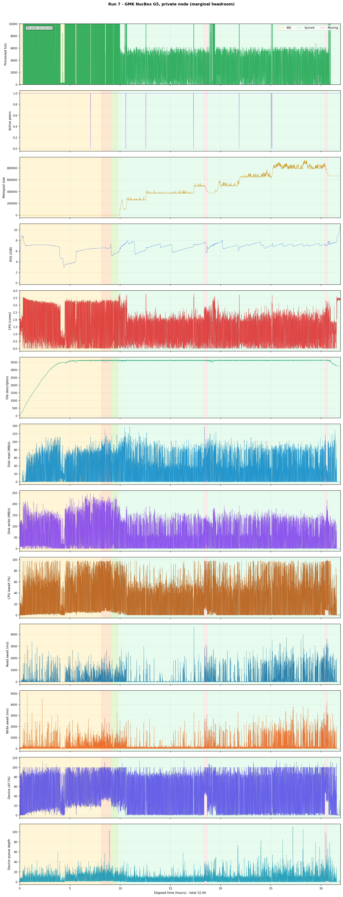
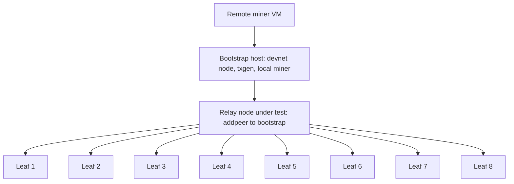
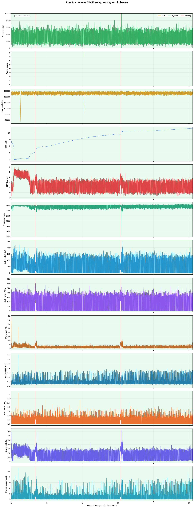
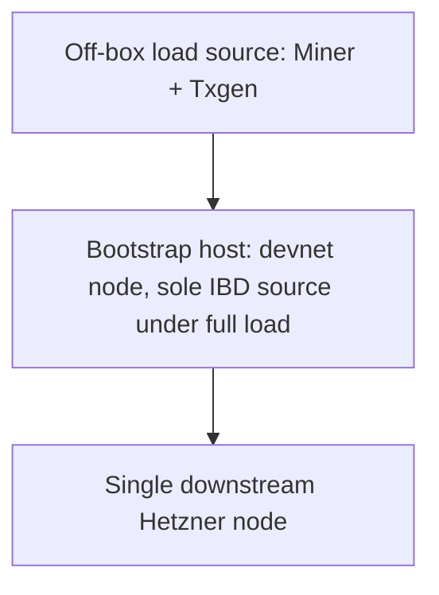

# Abstract

This report characterises Kaspa node behaviour under sustained maximum-throughput stress. The study used a devnet configured to mirror current mainnet consensus settings and driven to roughly 3 000 observed TPS, the practical throughput ceiling observed at 10 BPS. The core measurements cover a non-archival node with the UTXO index enabled, across initial block download (IBD), sustained synchronised runtime, pruning windows, and controlled downstream-serving scenarios.

Across the measured runs, the failing hosts showed severe storage-path distress: high write latency, deep queue depth, and elevated iowait well before memory exhaustion. One host with a weak storage path entered post-prune recovery trouble and was later killed by the kernel out-of-memory handler. A smaller 4-core / 12 GiB host lasted longer under sustained strain, then also ended in an OOM kill. The tested 8 vCPU / 16 GiB Hetzner Cloud host, a standard shared-vCPU instance with local SSD storage costing roughly USD 31 per month, passed direct IBD, sustained synchronised stress, pruning overlap, and serving up to eight simultaneous downstream peers. In the serving runs, the extra load showed up mostly in read traffic, CPU load, and memory use, not in write-path degradation. These results bound one heavy-load case. They do not prove unrestricted public-node behaviour.

## TL;DR

If you're only interested in practical recommendations, jump to the [hardware requirements section](#6-recommended-hardware-requirements) or the [cloud cost envelope](#7-cloud-cost-envelope). The rest of this report documents the evidence and caveats behind those recommendations.

## 1. Introduction and scope

During the Kaspadrome period of sustained network load, some node operators on weaker hardware visibly fell out of sync and some exchanges paused Kaspa transactions. The immediate operator question was simple: what hardware keeps a node healthy through that load, especially through pruning windows, and what does it cost to run it in the cloud?

Real-world evidence from that period was incomplete. External submissions showed sustained disk pressure, memory growth, and repeated sync failures on weaker hardware, but none were normalised enough for publication. The work therefore moved to controlled devnet reproduction, where workload, host class, and capture stack could be standardised.

This report characterises one operating envelope, not a universal Kaspa sizing guide. The measured envelope is a non-archival node with the UTXO index enabled, under sustained synthetic devnet load at roughly 3 000 TPS and 10 BPS. The report asks which hardware profiles clearly fail, what the lowest passing profile looks like under that stress shape, and what comparable cloud capacity costs in Europe, North America, and Asia.

The controlled serving scenarios are boundary tests, not proof of unrestricted public-node behaviour. The conclusions should not be generalised to archival nodes, different payload regimes, or arbitrary public-serving conditions without further evidence.

## 2. Methodology

### 2.1. Workload

The core workload is sustained synthetic devnet traffic at roughly 3 000 observed TPS and 10 BPS. The devnet was configured to mirror current mainnet consensus settings at 10 BPS, at which a practical throughput ceiling of roughly 3 000 TPS was observed.

Node resource usage is not a simple function of TPS alone. It depends on transaction payload size, whether pruning is active, node configuration, peer traffic, and storage characteristics. Claims in this report stay narrow: under this workload, on this host class, a given metric reached a given level. They are not universal scaling laws.

One caveat remains. The payload characteristics of the devnet traffic are not tightly proven against the Kaspadrome workload shape. If real-world kaspadrome-era traffic used materially larger payloads, some storage conclusions could shift.

### 2.2. Node profile

The measured node profile throughout the study is:

- non-archival
- UTXO index enabled (`--utxoindex`)
- `--perf-metrics` enabled at one-second intervals for instrumentation

This represents a standard non-archival node with the UTXO index opted in, chosen to cover the widest feature surface a normal operator might enable. Archival nodes, nodes without the UTXO index, and nodes with non-default RocksDB presets were not tested.

The software and operating system stack was consistent across all core devnet runs:

- `kaspad` version 1.1.0 (commit `dac7407e`)
- Ubuntu 24.04 LTS (24.04.4 on Hetzner, 24.04.3 on Proxmox and GMK)
- default filesystem and storage configuration as provisioned by each host's platform
- RocksDB configuration: `kaspad` defaults (no custom tuning)

### 2.3. Host classes

Four host classes were used across the study. The first was used only for precursor mainnet runs; the remaining three produced the core devnet evidence set.

| Label | Provider | CPU | vCPU | RAM GiB | Storage | Role in study |
| --- | --- | --- | ---: | ---: | --- | --- |
| Hetzner CCX33 | Hetzner Cloud, Helsinki | AMD EPYC (dedicated) | 8 | 32 | local SSD, ~240 GiB | precursor mainnet captures only |
| Hetzner CPX42 | Hetzner Cloud, Helsinki | AMD EPYC (shared) | 8 | ~16 | local SSD, ~300 GiB | healthy reference, serving host |
| Proxmox VM | home-lab Proxmox | AMD Ryzen 7 5800X | 12 | ~25 | local SSD (weak write baseline) | failure boundary |
| GMK NucBox G5 | home-lab | Intel N97 | 4 | ~12 | local SSD | small-box headroom test |

The CCX33 is a dedicated-vCPU instance with 32 GiB of RAM. It was used for the initial mainnet captures but remained well within its capacity under mainnet load, failing to reveal any resource boundaries. The CPX42 is a standard shared-vCPU cloud instance costing roughly USD 31 per month, not a dedicated server or high-end bare-metal machine. The Proxmox host had more vCPUs and more RAM than the CPX42, but its storage path showed a notably weak unloaded write baseline (~49 MB/s sequential write, ~7 MB/s random 4 KiB write). The GMK host is a compact low-power desktop with only ~12 GiB of RAM.

### 2.4. Study design

The study progressed through four phases.

1. **Precursor runs** (runs 1–4), summarised in Appendix A, established that IBD, synchronised runtime, and pruning overlap are distinct operating states, and that a heavily loaded node on weak storage is a poor sole IBD source.
2. **Baseline and failure boundary** (runs 5–7) tested the three host classes under the same sustained devnet load. Run 5 on the Hetzner host is the passing reference case. Run 6 on the Proxmox host is the storage-path failure case. Run 7 on the GMK host is the small-box headroom failure case.
3. **Controlled serving extension** (runs 8a–8c) measured serving pressure on the healthy Hetzner host while it fed one, two, and then eight simultaneous downstream peers performing initial block download. These runs probe the read-side and CPU cost of serving without collapsing it into the private-node baseline.
4. **Post-run storage baselines** were captured with `fio` on unloaded hosts after relevant runs, providing independent confirmation of each host's raw storage capability.

For brevity, the serving host in runs 8a–8c is sometimes referred to as the *relay*, and the downstream peers as *leaves*. These are study-specific labels for the controlled topology, not protocol-level roles.

Throughout the serving runs, the relay used `--addpeer` to maintain its upstream bootstrap relationship while leaves used `--connect` to pin themselves to the relay. This design was necessary because `--connect` on the relay would have disabled normal inbound-serving behaviour. The topology was deliberately constructed, not an emergent public-network shape.

### 2.5. Capture stack

Each publishable run used a standardised capture stack:

- full `kaspad` log with one-second performance metrics
- host-level CPU, memory, disk, and network sampling
- RPC polling for sync state, mempool, peer count, and processed transactions
- `iostat` device-level I/O telemetry (latency, queue depth, utilisation)
- RocksDB log scraping for compaction, flush, and stall events
- automated summary generation from raw artifacts

Frozen run directories contain raw CSV telemetry, summary statistics, metadata, and findings notes. Tables in this report are derived from those summaries.

## 3. Core evidence matrix

Each row is one continuous `kaspad` session from cold start through whatever phases the node reached. From run 5 onward, all core measurements used the same continuously running devnet bootstrap on a Hetzner CPX42; what changed from run to run was the measured node and, in runs 8a–8c, the downstream-serving shape.

| Run | Host class | Topology | Duration | Outcome |
| --- | --- | --- | --- | --- |
| 5 | Hetzner CPX42 | private node | 251 891 s (~70 h) | healthy through IBD, synced stress, and six prune windows |
| 6 | Proxmox VM | private node | 36 485 s (~10 h) | healthy through IBD; post-prune storage failure, then OOM |
| 7 | GMK NucBox G5 | private node | 115 023 s (~32 h) | completed IBD; survived three prune windows with high write latency, then OOM |
| 8a | Hetzner CPX42 | relay + 1 cold leaf | 33 358 s (~9 h) | healthy throughout; leaf synced, one relay prune captured |
| 8b | Hetzner CPX42 | relay + 1 synced + 1 cold leaf | 9 111 s (~2.5 h) | healthy throughout; leaf synced, no prune captured |
| 8c | Hetzner CPX42 | relay + 8 cold leaves | 91 778 s (~25.5 h) | healthy throughout; all eight leaves synced, two relay prunes captured |

## 4. Findings

Throughout this section, outcome labels are used with specific operational meanings:

- **Passed:** the node remained synchronised (`is_synced = 1`), suffered no OOM kill, recorded zero RocksDB stall events, and completed the full planned run duration.
- **Failed:** the node was killed by the kernel OOM handler, lost synchronisation, or both.
- **Headroom:** the margin between observed peak resource usage and the host's capacity limits, primarily RSS versus available RAM, and write await versus the latency levels associated with failure in other runs.

**Metric definitions for tables in this section:**

- **RSS max GiB:** peak resident set size of the `kaspad` process, from `node-metrics.csv` (sampled at one-second intervals).
- **CPU p95:** 95th percentile of `kaspad` CPU usage in cores (e.g. 2.0 = two full cores), from `node-metrics.csv`.
- **Read / Write p95 MB/s:** 95th percentile of device-level read or write throughput, from `iostat-metrics.csv` (sampled at one-second intervals). Units are decimal MB/s as reported by `iostat`.
- **Write await p95 ms:** 95th percentile of device-level write latency (average time from request submission to completion), from `iostat-metrics.csv`.
- **Queue depth p95:** 95th percentile of device average queue depth (`avgqu-sz`), from `iostat-metrics.csv`.
- **p95 values** are computed over all one-second samples within the stated phase window.

**Phase window rules:** phase boundaries are derived from `events.csv` markers emitted by the capture tooling. IBD ends when the node first reports `is_synced = 1`. Pruning windows are bounded by `prune_start` and `prune_end` events from `kaspad` log parsing. "Synced stress" covers the interval between IBD completion and the first prune start. "Synced stress + pruning" covers the interval from IBD completion through all subsequent prune windows to session end. For runs 8a–8c, "whole run" is the full session from cold start to capture stop; the relay was already synchronised at session start.

The following table summarises key resource metrics across all core runs. Runs 5–7 are broken into specific operating phases because resource profiles differ materially between states; runs 8a–8c are whole-session numbers, as the relay remained in a consistent operating state throughout.

| Run | Phase | RSS max GiB | CPU p95 | Read p95 MB/s | Write p95 MB/s | Write await p95 ms | Queue depth p95 | Outcome |
| --- | --- | ---: | ---: | ---: | ---: | ---: | ---: | --- |
| 5 | synced stress | 9.32 | 1.78 | 60.55 | 177.50 | 3.86 | 1.34 | healthy baseline |
| 5 | synced stress + pruning | 10.66 | 1.95 | 88.88 | 173.24 | 3.97 | 1.48 | healthy through prune |
| 6 | post-prune stall | 24.71 | 5.52 | 33.27 | 65.61 | 92.05 | 12.98 | storage failure, then OOM |
| 7 | synced stress + pruning | 10.60 | 2.43 | 54.84 | 110.65 | 768.00 | 13.60 | survived with high latency, then OOM |
| 8a | whole run | 6.90 | 2.41 | 75.16 | 178.50 | 4.06 | 1.53 | healthy throughout |
| 8b | whole run | 7.60 | 2.67 | 96.71 | 170.31 | 3.84 | 1.88 | healthy throughout |
| 8c | whole run | 10.69 | 4.38 | 103.65 | 169.55 | 3.98 | 1.71 | healthy throughout |

The contrast between healthy runs and failure runs is sharpest in write latency and queue depth. On the Hetzner host, write await p95 stayed below 4.1 ms in every synchronised and pruning window; during IBD it reached 5.04 ms, still within the range observed on healthy hosts. On the Proxmox host it reached 92 ms; on the GMK host, 768 ms.

### 4.1. Healthy reference: Run 5

Run 5 on the Hetzner CPX42 is the primary passing reference. The full session ran for roughly 70 hours across three phases: IBD (~1.4 h), synchronised stress (~4.9 h), and a pruning-overlap window (~63.5 h) that contained six prune cycles.

| Phase | Duration s | RSS max GiB | CPU p95 | Read p95 MB/s | Write p95 MB/s | Write await p95 ms | Queue depth p95 |
| --- | ---: | ---: | ---: | ---: | ---: | ---: | ---: |
| IBD | 5 097 | 10.05 | 5.35 | 183.46 | 406.08 | 5.04 | 3.80 |
| Synced stress | 17 804 | 9.32 | 1.78 | 60.55 | 177.50 | 3.86 | 1.34 |
| Synced stress + pruning | 228 971 | 10.66 | 1.95 | 88.88 | 173.24 | 3.97 | 1.48 |

IBD was the heaviest phase by a large margin: write throughput p95 reached 406 MB/s compared with roughly 175 MB/s during synchronised runtime. Even so, the storage path remained controlled. Write await p95 stayed at 5.04 ms and device utilisation p95 was 48.6%. Once the node entered synchronised operation, pressure dropped sharply and stayed low throughout the pruning window.

The post-run unloaded `fio` baseline on the same host confirms this was not a marginal storage path. With `kaspad` stopped, the host produced roughly 2 900 MB/s sequential write, 3 500 MB/s sequential read, 60 000 random write IOPS, and 66 000 random read IOPS. Run 5 remains the strongest current evidence for what healthy heavy-load operation looks like on the tested node profile.

*Figure 4.1. Run 5 full-session timeline. Coloured bands mark operating phases: IBD (yellow), synced (green), pruning (red). Fourteen metrics shown; sampling intervals vary by source (node performance metrics at one second, iostat and RPC at one second, RocksDB stall at roughly ten-minute intervals).*

### 4.2. Failure boundaries: Runs 6 and 7

Runs 6 and 7 both ended in kernel OOM kills, but they reached that point through different paths.

**Run 6** on the Proxmox VM is the storage-path failure case. The node synced and completed its initial prune successfully, then stopped making chain progress. While stalled, `is_synced` dropped to zero, key counters flatlined, and RSS climbed into the 24–26 GiB range until the kernel killed `kaspad` at 2026-04-05 08:24:14 AEST. The storage metrics tell the underlying story: write await p95 reached 92 ms (versus 3.9 ms on the Hetzner host), queue depth p95 reached 13.0, and host CPU iowait p95 reached 45.7%. RocksDB stall percentage reached 1.6–1.8% p95, the only run in the dataset with a non-zero stall reading.

The Proxmox host was deliberately included as the low-end storage boundary test. Its unloaded `fio` baseline measured roughly 49 MB/s sequential write and 7 MB/s random 4 KiB write. That is far below what a modern NVMe or a good SATA SSD would deliver, but it is plausible for a virtualised home-lab or a budget VPS with shared or thin-provisioned backing. At this storage tier, the node entered post-prune recovery trouble and memory ballooned until the kernel intervened. This host had 12 vCPUs and 25 GiB of RAM, more than the Hetzner host on both counts, so extra CPU and RAM did not compensate for the weak storage path in this case.

**Run 7** on the GMK NucBox G5 is the headroom failure case. Its unloaded `fio` baseline was materially stronger than run 6: 58 MB/s sequential write, 93 MB/s random 4 KiB write at roughly 23 000 IOPS. The node completed IBD and survived three prune windows over roughly 32 hours, but with chronically high write latency and almost no memory slack: write await p95 reached 768 ms, queue depth p95 reached 13.6, host CPU iowait p95 reached 72.1%, and RSS reached 10.6 GiB on a host with roughly 12 GiB of RAM. The kernel OOM-killed `kaspad` at 2026-04-05 20:07:07 AEST.

The two failures therefore point at different boundaries. Run 6 shows that a weak storage path can fail even on a host with more CPU and RAM than the passing Hetzner instance. Run 7 shows that a small host with limited CPU and RAM can survive for a while, but not with enough margin to be a safe recommendation under this workload.

*Figure 4.2. Run 6 full-session timeline (Proxmox VM). The storage-path failure is visible in the write await, device util, and queue depth panels during and after the pruning window. RSS climbs continuously after the node stalls.*

*Figure 4.3. Run 7 full-session timeline (GMK NucBox G5). Write await and device utilisation are chronically elevated throughout. The node survived three prune windows before the kernel OOM-killed it.*

### 4.3. Serving pressure: Runs 8a–8c

The relay-serving runs measured how much additional load downstream peers place on a healthy serving host. The Hetzner CPX42 acted as the relay; downstream leaves connected via `--connect` as described in section 2.4.

*Figure 4.4. Relay-serving topology. The bootstrap stays upstream, generating and mining. The relay, the node under test, syncs from the bootstrap via `--addpeer` and carries the downstream serving load. Leaf nodes pin to the relay via `--connect`. Runs 8a and 8b used fewer leaves; the full eight-leaf topology shown here is run 8c.*

**Scaling pattern.** From one cold leaf (8a) through one synced plus one cold (8b) to eight simultaneous cold leaves (8c), serving pressure landed primarily on read traffic, CPU load, and outbound peer-to-peer bandwidth. The write path remained stable.

| Window | Peers | RSS max GiB | CPU p95 | Read p95 MB/s | Write p95 MB/s | Write await p95 ms | Queue depth p95 |
| --- | ---: | ---: | ---: | ---: | ---: | ---: | ---: |
| Run 5 baseline | 1 | 9.32 | 1.78 | 60.55 | 177.50 | 3.86 | 1.34 |
| Run 8a (1 cold leaf) | 2 | 6.90 | 2.41 | 75.16 | 178.50 | 4.06 | 1.53 |
| Run 8b (1 synced + 1 cold) | 3 | 7.60 | 2.67 | 96.71 | 170.31 | 3.84 | 1.88 |
| Run 8c (8 cold leaves) | 9 | 10.69 | 4.38 | 103.65 | 169.55 | 3.98 | 1.71 |

Write throughput p95 barely moved across the four rows (170–178 MB/s). Write await p95 stayed between 3.84 and 4.06 ms. CPU p95 roughly doubled from baseline to 8c. Read throughput p95 rose from 61 to 104 MB/s. The scaling was clearly sub-linear: eight leaves did not produce eight times the relay load.

During the eight-leaf IBD burst in 8c, average outbound P2P traffic, derived from `p2p_bytes_tx` counter deltas in `rpc-metrics.csv` over the active leaf-IBD window, reached roughly 39 MiB/s (versus roughly 5 MiB/s in 8a and negligible in the run 5 synced baseline). After all leaves synced, CPU and read throughput fell back toward baseline levels, and the persistent cost settled to higher RSS and routine serving overhead.

**Prune stability.** The two prune windows captured in 8c are the strongest stability signal in the serving dataset. Write throughput averaged roughly 159 MB/s in both windows. Write await stayed at 4.1–4.3 ms average with 5.5–6.0 ms p95. The second prune occurred many hours into the run with relay RSS averaging 9.72 GiB, and was not measurably worse than the first. RocksDB stall percentage remained 0.00% throughout.

**Downstream sync timing.** Relay-fed sync was consistently slower than direct bootstrap sync.

| Path | Duration s | Multiplier vs direct |
| --- | ---: | ---: |
| Run 5 direct bootstrap | 5 097 | 1.00x |
| Run 8a, 1 leaf via relay | 8 805 | 1.73x |
| Run 8b, leaf 2 via relay | 8 110 | 1.59x |
| Run 8c, first leaf synced | 8 918 | 1.75x |
| Run 8c, cohort average | 9 201 | 1.81x |
| Run 8c, last leaf synced | 9 566 | 1.88x |

The penalty was already present with one leaf and grew modestly with eight. The eight-leaf cohort was tightly clustered (648-second spread from first to last), suggesting the relay served leaves reasonably evenly. The leaf-side `rpc-poller` in run 8a failed with an exec-format error, so leaf timing for that run was reconstructed from `kaspad.log` and `events.csv` rather than from a complete RPC time series.

*Figure 4.5. Run 8c relay timeline (serving 8 cold leaves). CPU and disk read are visibly elevated during the first ~2.5 hours while leaves sync, then drop. Two prune windows show as write-throughput spikes. Write await and device util remain controlled throughout.*

Across the full dataset, storage-path metrics deteriorated before the OOM kill in both failure runs. Write await, queue depth, and iowait were the earliest visible warning signs. The serving runs answer a narrower question than the private-node runs: they show the cost of controlled downstream serving on one healthy host class, not unrestricted public-node behaviour. The gap between 4 vCPU / 12 GiB and 8 vCPU / 16 GiB remains unmeasured.

## 5. Observed outcomes

| Outcome | Profile class | Evidence | Meaning |
| --- | --- | --- | --- |
| Failed | Weak storage path regardless of CPU/RAM (run 6 class), or severely resource-constrained host (run 7 class) | Runs 6, 7 | OOM kill after post-prune distress or resource exhaustion |
| Lowest passing profile | 8 vCPU / 16 GiB / local SSD-class storage (run 5 class) | Runs 5, 8a–8c | Passed all tested phases, including heavy serving load |

A host with a weak storage path (run 6: ~49 MB/s sequential write, ~7 MB/s random write) failed even with 12 vCPUs and 25 GiB of RAM. A 4 vCPU / 12 GiB host (run 7) survived longer but still ended in an OOM kill after prolonged operation with high write latency and almost no memory headroom. Either result rules out that host class for sustained operation under this workload.

The 8 vCPU / 16 GiB class with local SSD-class storage is the lowest profile in the dataset that passed every tested scenario: direct IBD, sustained synchronised stress, six prune windows over 70 hours, and serving eight simultaneous downstream peers. Write await p95 never exceeded 5.04 ms in any measured window. RocksDB stall percentage was 0.00% throughout.

The true minimum viable profile may lie somewhere between the failing 4 vCPU / 12 GiB host and the passing 8 vCPU / 16 GiB host, but this dataset does not locate that boundary. What it does establish is that 4 vCPU / 12 GiB is not enough, and that higher CPU and RAM counts did not compensate for a weak storage path in the one case where that was tested.

## 6. Recommended hardware requirements

This guidance is scoped to the measured workload shape: a non-archival node with the UTXO index enabled, under sustained stress at roughly 3 000 TPS and 10 BPS.

### 6.1. Recommended hardware specs

- 8 vCPU
- 16 GiB RAM
- local SSD-class storage
- storage capacity: 320 GiB validated in this study; 500 GiB recommended for operating margin
- minimum storage throughput under load: 180 MB/s read, 380 MB/s write

### 6.2. Practical checklist

- **Storage first.** In this dataset, weak storage failed even when CPU and RAM were higher than on the passing reference host.
- **Use 8 vCPU / 16 GiB / local SSD-class storage as the reference point.** It is the lowest profile in this study that passed direct IBD, sustained synchronised stress, repeated prune windows, and controlled downstream serving.
- **Treat the storage throughput minimum as a heavy-load floor.** The 180 MB/s read and 380 MB/s write figures are anchored to the heaviest healthy cold-IBD window in this dataset. Lower-throughput healthy synced or pruning windows do not contradict that floor because they were asking less of the disk.
- **Do not treat HDDs as validated by this study.** Every passing run used local SSD-backed cloud storage. No network-attached, thin-provisioned, or spinning-disk configuration was tested in a passing scenario.
- **Budget for serving overhead.** Serving added load mostly on read throughput, CPU, and RSS. The 8 vCPU / 16 GiB class stayed healthy while serving eight simultaneous downstream peers, but smaller hosts may not.
- **Monitor write latency and queue depth during operation.** In the failure runs, those were earlier warning signals than RSS alone.

The serving tests used a controlled topology with known peer counts and pinned connections. They should not be taken as proof that any 8 vCPU / 16 GiB host will sustain arbitrary public traffic.

## 7. Cloud cost envelope

The table below lists cloud instances that match the lowest passing profile (8 vCPU / 16 GiB), or the closest available equivalent, across Europe, North America, and Asia. Prices were collected on 2026-04-06 from each provider's public pricing page. Only Hetzner CPX42 storage throughput was benchmarked in this study. Other providers' storage paths were not independently tested.

| Provider | Plan | vCPU | RAM GiB | Storage | Monthly | Currency | Regions |
| --- | --- | ---: | ---: | --- | ---: | --- | --- |
| Netcup | VPS 2000 G11 iv 12M | 8 | 16 | 512 GiB NVMe | 21.41 | EUR | Europe (3 cities), North America, Asia |
| Hetzner | CPX42 | 8 | 16 | 320 GiB SSD | 30.59 | USD | Europe (3 cities) |
| Hetzner | CPX42 | 8 | 16 | 320 GiB SSD | 66.59 | USD | Asia (Singapore) |
| Vultr | Cloud Compute 6vCPU/16GiB | 6 | 16 | 320 GiB SSD | 80.00 | USD | Europe (7), North America (10), Asia (7) |
| DigitalOcean | Basic 8vCPU/16GiB | 8 | 16 | 320 GiB NVMe | 96.00 | USD | Europe (3), North America (3), Asia (3) |
| Linode/Akamai | Shared 16GB | 6 | 16 | 320 GiB SSD | 96.00 | USD | Europe (2), North America (7), Asia (6) |

Notes:

- Hetzner Europe (~USD 31/month) is the only benchmark-qualified plan in this study. The same plan in Singapore is roughly double, and Hetzner does not currently offer a North American location for it.
- Netcup Europe (~EUR 21/month) is the cheapest shortlist entry, but its storage path was not benchmarked for this workload.
- Vultr and Linode/Akamai offer 6 vCPU / 16 GiB equivalents rather than 8 vCPU / 16 GiB, which adds uncertainty.
- Prices cover base compute and included storage only. Egress, extra storage, backup, and snapshot costs are excluded.

No single budget provider covers Europe, North America, and Asia at the benchmark-qualified price point.

## 8. Limitations

- **One passing host class.** The lowest passing profile is anchored to one host class (Hetzner CPX42) from one provider. The study does not prove that every 8 vCPU / 16 GiB instance from every provider will behave the same way.
- **No intermediate profiles.** The gap between the failing 4 vCPU / 12 GiB host and the healthy 8 vCPU / 16 GiB host was not filled with 6 vCPU or 8 vCPU / 12 GiB profiles.
- **No replication.** Each host-class condition is represented by a single run. On shared-vCPU infrastructure, run-to-run variance from noisy neighbours, scheduling jitter, and storage contention is real but unquantified here.
- **Synthetic devnet workload.** The stress load was generated on a controlled devnet. While the devnet mirrored mainnet consensus settings, the payload characteristics are not tightly proven against kaspadrome-era traffic.
- **No unrestricted public-node measurement.** The serving runs used controlled topologies with known peer counts. They are useful boundary tests, not proof of open-internet serving capacity.
- **One weak-storage failure mode.** Only one weak-storage host was tested. The range between the Proxmox baseline and the Hetzner baseline is not characterised.
- **Pricing snapshot only.** The cloud cost envelope is based on a single pricing snapshot, and storage throughput on providers other than Hetzner was not benchmarked.
- **No long-term degradation study.** The longest single run was roughly 70 hours. Effects that show up over weeks or months were not measured.

## 9. Conclusion

Under this workload, the failing hosts showed severe storage-path distress before they ran out of memory. High write latency, deep queue depth, and elevated iowait appeared early in both failure cases. On the passing host, those metrics stayed controlled in every tested window.

A standard shared-vCPU cloud instance (8 vCPU / 16 GiB / local SSD-class storage, roughly USD 31 per month) passed every tested scenario: initial block download, sustained synchronised stress, six prune windows over 70 hours, and serving eight simultaneous downstream peers. In this dataset, that is the lowest passing profile. The 4 vCPU / 12 GiB host failed.

Use 8 vCPU / 16 GiB with local SSD-class storage as the reference point, verify the storage path before deployment, and watch write latency and queue depth for early trouble. Hetzner CPX42 is the only plan in the pricing table whose storage path was benchmarked in this study.

## Appendix A. Precursor runs

Runs 1–4 shaped the study design but are not used for sizing claims.

| Run | Environment | Main lesson |
| --- | --- | --- |
| 1–3 | Mainnet on Hetzner CCX33 (8 vCPU / 32 GiB, dedicated), one continuous session during kaspadrome-driven load (~2 300–2 400 processed tx/s), phases auto-split by capture tooling | IBD is materially heavier than synchronised runtime; pruning raises disk pressure materially, even on healthy cloud storage |
| 4 | Devnet bootstrap contention (manual), home-lab Proxmox VM | a heavily loaded bootstrap on weak local storage is a poor sole IBD source; storage path too slow for bootstrap duty |

Runs 1–3 were sequential windows from the same CCX33 mainnet session. They showed that IBD is heavier than synchronised runtime and that pruning adds material disk pressure, but the host was too comfortable to expose any resource boundary. Run 4 then attempted to bootstrap the devnet locally on the Proxmox VM. The downstream node timed out after 120 seconds, which is why later serving tests used a separated relay topology.

*Figure A.1. Bootstrap-direct topology (run 4). Off-box miner and txgen load drove the bootstrap while a single downstream node synced directly from it. This mixed-load shape, heavy write load plus direct serving, made the bootstrap a poor IBD source on weak storage and motivated the separated relay topology used later (see Figure 4.4).* 
